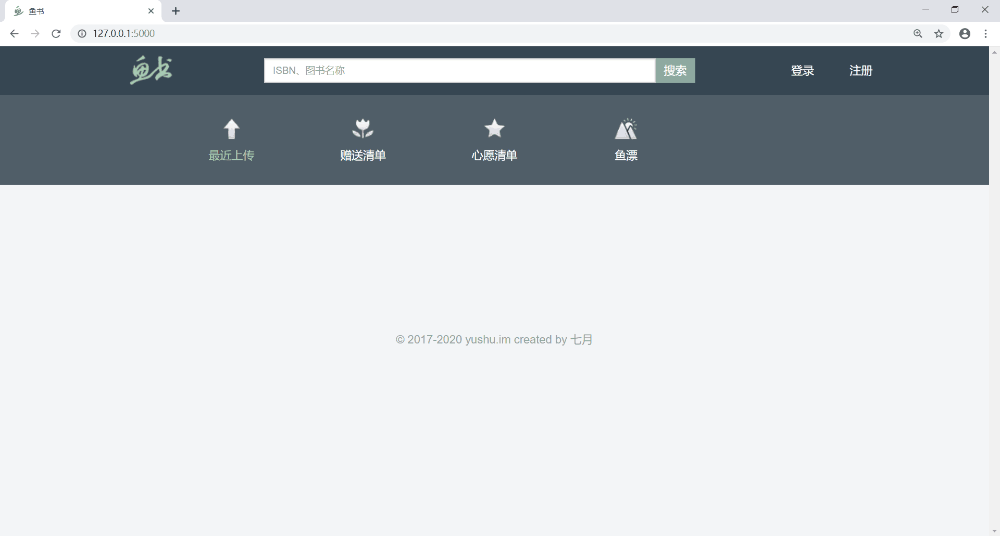
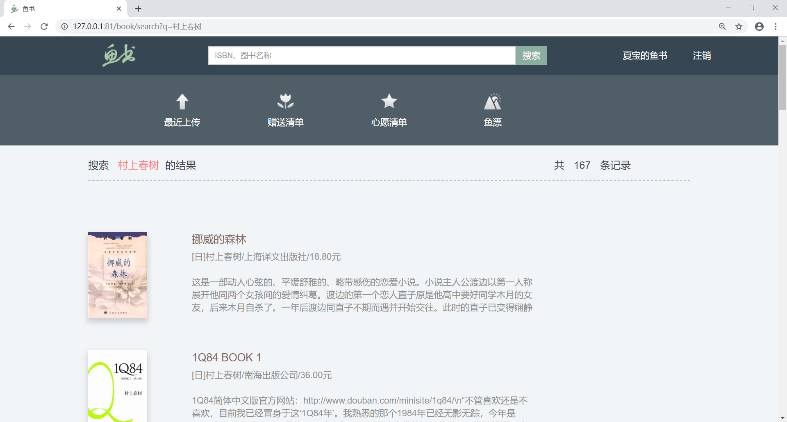
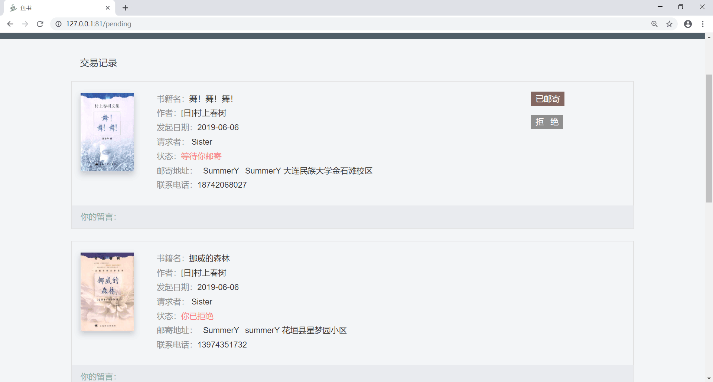
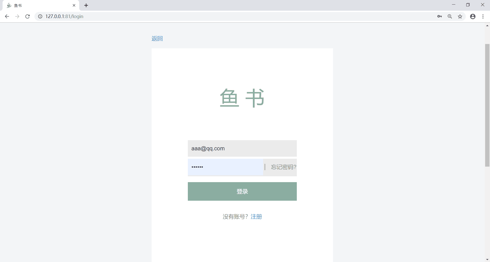

# flask_fisher 鱼书
基于python3.6和flask的书籍交易网站

## 功能
该网站为用户提供进行相关书籍查询以及书籍交易平台，其中包括用户的注册登录以及忘记密码等操作，用户可以自行进行图书交易。

## 部署
项目是创建在虚拟环境（pipenv）中的，因此需要导入相应的模块或包才能正常运行(使用pip install进行导入)

项目正常运行后，打开浏览器输入网址（http://localhost:5000）即进入鱼书首页。

项目效果如下图所示：

